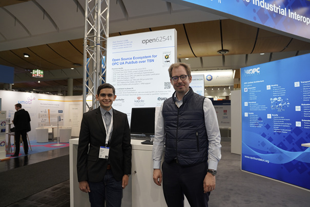

+++
fragment = "content"
title = "June 2022 Community Newsletter"
weight = 100
display_date = true
date = "2022-06-15"

summary = """
This is the June 2022 Community Newsletter.
"""

#[asset]
#  image = "releasenote.png"
+++

**open6241 @ Hannover Fair:**

This year did we again present open62541 at the Hannover Fair. 
See below the “partner pod” at the booth of the OPC Foundation. 
It was great connecting with the community directly after two years of remote work.
Thanks also to OSADL and Kalycito for co-organizing the booth.

**New open62541 Website – Interview with Götz Görisch**

The new open62541-website is now finally online!
We also started to publish articles and news on the new website. 
open624Make sure you read the great interview with Götz Görisch from the VDW – Verein Deutscher Werkzeugmaschinenfabriken e.V.
[Link to the Interview](https://www.open62541.org/articles/22_05_29_vdw_interview/)

**Development News**

1. Patch Release v1.2.5 and v1.3.1

We received a responsible disclosure of a security issue from Team 82 / Claroty.
The default configuration of open62541 allowed for messages of unlimited size / unlimited number of chunks.
This can obviously be used for a denial-of-service attack for OPC UA applications on constrained devices.

The v1.2.5 and v1.3.1 patch releases rectify the issue (on master as well).
The new default are messages up to 512 MB comprised of up to 16k chunks.

Users of older versions are advised to adjust the settings in the client/server configuration.

2. JSON5 Parsing Backend

JSON5 is a superset of the JSON standard with many usability improvements (https://json5.org/).
open62541 now includes the possibility to parse JSON5. This will be used in the future for textfile-based configuration.
Going forward, the parsing of the OPC UA data types will be switched over to the new JSON5 backend as well.
That way, configuration textfiles can include OPC UA data types in the JSON encoding that are automatically decoded.

3. Server switched to the EventLoop model

A lot of work went into the EventLoop model of the core control flow in open62541.
The server is now switched over to the EventLoop. The Client, PubSub and Discovery subsystems are now being switched over as well.

The EventLoop aggregates all network interactions into a single "select" syscall.
This will enable performant networking with many protocols (OPC UA Binary, PubSub UADP, PubSub MQTT, IP Multicast Discovery and in the future also HTTP, AMQP, etc.) and allows the concurrent operation of multiple servers and clients in a single thread.

Eventually the EventLoop will act as the uniform hardware-abstraction-layer interface so that the core open62541 library is maximally portable and can "converge" to a stable state.